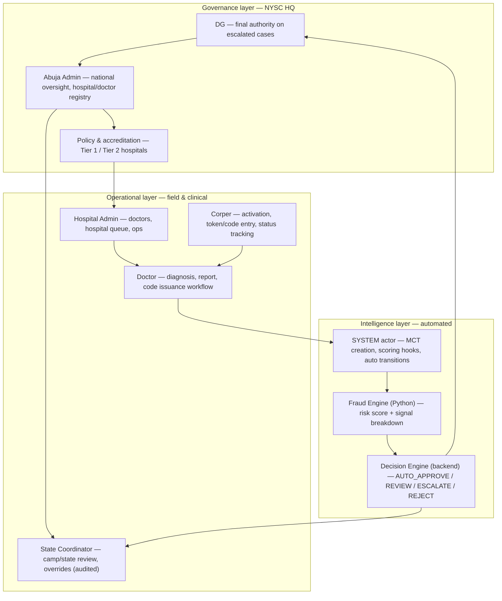
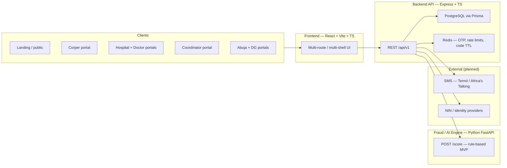
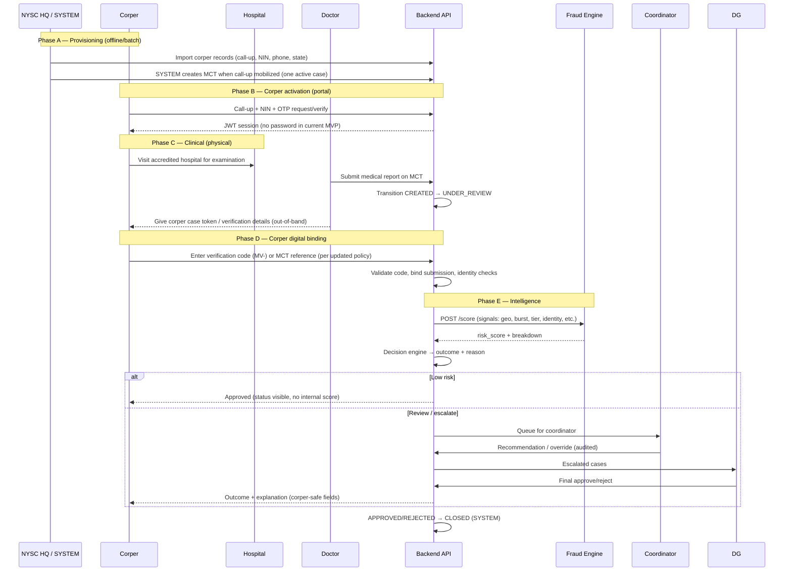
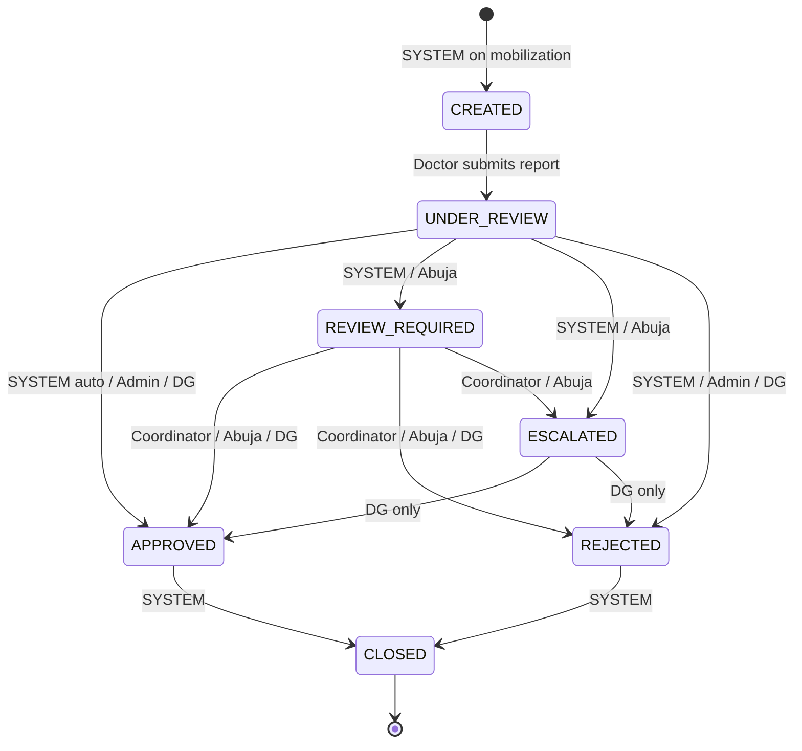
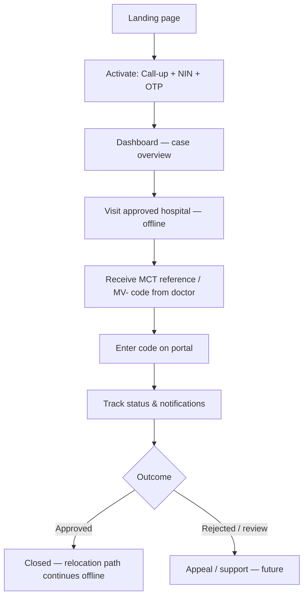
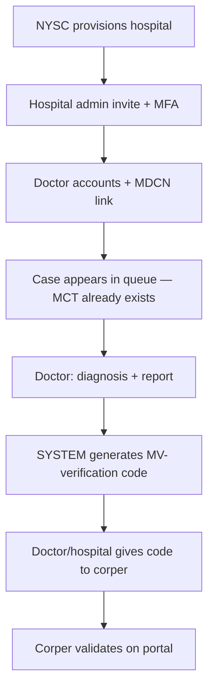
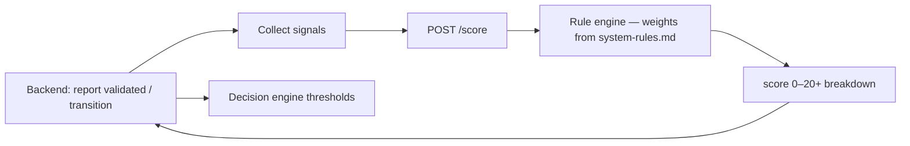
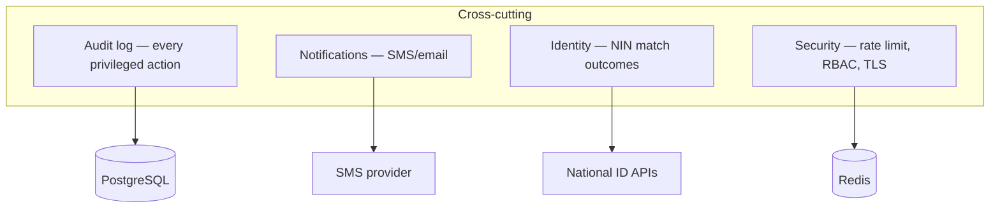

# MedVerify — Full Project Architecture & Flow

**Purpose:** Single reference for how the NYSC Medical Verification System is structured end-to-end — actors, flows, services, and utilities across **frontend**, **backend**, and **fraud/AI engine**.

**Governed by:** `documentation/system-rules.md` (wins on conflicts for MVP implementation).

**Last updated:** 2026-05-21

---

## 1. What we are building

A **multi-portal, fraud-resistant** national platform that replaces paper medical relocation trust with:

- Accredited hospital + doctor control over medical reports  
- **System-managed cases** (MCT lifecycle)  
- **Identity binding** (call-up + NIN + OTP activation)  
- **One-time verification codes** (`MV-…`) after doctor submission  
- **Rule-based risk scoring** (Python service)  
- **Explainable decisions** with full audit trail  

---

## 2. Governance organogram (who exists in the system)



### Role summary

| Role | Portal | Primary responsibility |
|------|--------|------------------------|
| **Corper** | Corper (public-facing) | Activate identity; **enter MCT / verification details from hospital**; track own case only |
| **Doctor** | Doctor | Medical report on assigned MCT; triggers code generation path |
| **Hospital Admin** | Hospital | Doctor roster, hospital case queue, operational metrics |
| **Coordinator** | State | Flagged cases, recommendations, **audited overrides** (not final approval) |
| **Abuja Admin** | HQ | National dashboard, entity management, escalations |
| **DG** | Executive | Final approve/reject on **escalated** cases |
| **SYSTEM** | — | MCT provisioning, automated transitions, scoring orchestration |

**Rule:** No role-switching UI. Each role has an isolated frontend experience.

---

## 3. Three service layers (technical topology)



| Layer | Repo path (today) | Status |
|-------|-------------------|--------|
| Frontend | `frontend/` | Landing, corper login/activation, corper dashboard (partial) |
| Backend | `backend/` | Auth, MCT, verification codes, activation, audit, decisions (partial) |
| Fraud engine | *not in repo yet* | Planned FastAPI service per `technical-documentation.md` |

---

## 4. Canonical end-to-end flow (business)

This is the **intended** lifecycle. UI and APIs should converge here (see §12 for gaps).



### Critical distinctions (do not conflate in UI copy)

| Concept | Who creates it | Who consumes it | Format / rules |
|---------|----------------|-----------------|----------------|
| **MCT (case record)** | **SYSTEM** after call-up / mobilization — **not corper** | All roles (scoped); corper may **enter reference token** doctor gives to link | UUID case in DB; one **active** case per corper |
| **Verification code** | **SYSTEM** when doctor completes report workflow | **Corper enters** in portal | `MV-########`, 12h TTL, single-use, 3 fail lockout |
| **Portal activation OTP** | Backend on activation | Corper at login | SMS/dev OTP; separate from MV- code |

**Corper cannot:** create MCT, issue reports, see risk scores, see fraud internals, approve relocation.

---

## 5. MCT lifecycle (state machine)

Aligned with `system-rules.md` and Prisma `MctStatus`:



**Corper-visible labels (UI only):** Pending → Under review → Escalated → Approved / Rejected (map from internal enums; hide `REVIEW_REQUIRED` nuance if needed as “Under review”).

---

## 6. Per-actor journey maps

### 6.1 Corper journey



**Frontend pages (target):** Landing → Activation → Dashboard → Enter verification → Case status → Appeals → Profile  
**Reference UI:** `UI/corper-dashboard.html`, `UI/corper-dashboard.md`

### 6.2 Hospital / Doctor journey



**Frontend pages (target):** Hospital dashboard → Doctor management → Case queue → Report form → Code issuance status

### 6.3 Coordinator journey

Flagged cases → review queue → recommendation or **audited override** → escalation tracker. Cannot final-approve relocation.

### 6.4 Abuja Admin journey

National command center: live cases, hospital/doctor behavior, risk **explanations**, audit export, entity provisioning.

### 6.5 DG journey

Escalated cases only → executive decision workspace → final approve/reject with audit confirmation.

---

## 7. Frontend architecture

### 7.1 Principle

> Not one app with roles — **multiple portal experiences** sharing a design system.

**Design references:** `UI/corper-dashboard.md`, `frontend/documentation/frontend-architecture.md`, `documentation/frontend-update.md`

### 7.2 Portal map

| Portal | Route prefix (proposed) | Key screens | UX mode |
|--------|----------------------|-------------|---------|
| Public | `/` | Landing, verify status, hospital access info, security notice | Marketing / trust |
| Corper | `/corper/*` | Login/activation, dashboard, enter code, case status, appeals | Mobile-first, simple |
| Hospital | `/hospital/*` | Admin dashboard, doctors, queue, analytics | Enterprise dense |
| Doctor | `/doctor/*` | Assigned cases, report, code status | Fast clinical forms |
| Coordinator | `/coordinator/*` | State dashboard, review queue, overrides | Review-centric |
| HQ Admin | `/admin/*` | National ops, fraud explainability, registry | Intelligence UI |
| DG | `/dg/*` | Escalated approvals | Minimal decision UI |

### 7.3 Implemented today (`frontend/`)

| Area | Path | Notes |
|------|------|-------|
| Landing | `src/pages/LandingPage.tsx` | Dark green, map background |
| Corper activation | `src/pages/LoginPage.tsx` | Call-up + NIN + OTP → JWT |
| Corper dashboard | `src/pages/DashboardPage.tsx` | UI mock-based; **needs MCT copy fix** (no “create case”) |
| Shared map | `src/components/NigeriaMapBackground.tsx` | Landing + login |
| API client | `src/lib/api.ts`, `activation.ts`, `mct.ts` | Axios + cookies |
| Auth state | `src/store/auth.store.ts` | Zustand + localStorage |
| Routing | `src/routes/AppRouter.tsx`, `ProtectedRoute.tsx` | CORPER guard on dashboard |

### 7.4 Frontend utilities & libraries

| Utility | Package / location | Used for |
|---------|-------------------|----------|
| Bundler | Vite 8 | Dev + production build |
| UI framework | React 19 | Components |
| Routing | react-router-dom 7 | Multi-portal routes |
| Server state | @tanstack/react-query | Cases, mutations |
| Client state | zustand | Auth session |
| HTTP | axios | API with JWT interceptor |
| Forms | react-hook-form + zod | Activation, code entry |
| Styling | Tailwind CSS 4 | Tokens + layout |
| Icons | lucide-react | Dashboard chrome |
| Maps | d3-geo | Nigeria state map |
| Charts (planned) | recharts | HQ analytics |
| Motion (planned) | framer-motion | Constrained transitions |
| Toasts | sonner | Errors / success |
| Tables (planned) | @tanstack/react-table | Admin queues |
| Dates | date-fns | TTL display, timelines |

### 7.5 Shared frontend modules (target structure)

```
frontend/src/
  pages/           # route-level screens per portal
  features/        # corper-case, verification-code, hospital-queue, …
  components/      # design system + layout shells
  lib/             # api, auth, domain clients
  hooks/           # useAuth, useMctCase, useVerificationCode
  stores/          # zustand
  types/           # API contracts
```

### 7.6 Corper UI visibility rules (asymmetric)

**Show:** case status, timeline, own identity state, verification entry, outcome reason (sanitized)  
**Never show:** risk score, fraud flags, internal decision weights, other corpers’ data

---

## 8. Backend architecture

### 8.1 Stack

| Component | Technology |
|-----------|------------|
| Runtime | Node.js 20+ |
| Framework | Express + TypeScript |
| ORM | Prisma |
| Database | PostgreSQL |
| Cache | Redis (ioredis) |
| Auth | JWT + refresh cookies + CSRF token |
| Validation | Zod |
| Docs | Swagger (`/api-docs`) |
| Tests | Vitest + Supertest |

### 8.2 Layering

```
backend/src/
  routes/         → HTTP mapping
  controllers/    → request/response
  services/       → business rules
  middleware/     → auth, RBAC, rate limit, security
  lib/            → prisma, redis
  utils/          → errors, call-up normalization
```

### 8.3 API surface (implemented routes)

| Module | Base path | Purpose |
|--------|-----------|---------|
| Health | `GET /health`, `GET /ready` | Liveness + DB/Redis |
| Auth | `/auth/*` | Staff login, refresh, logout |
| Corper activation | `/corper/activation/*` | OTP request/verify → JWT |
| MCT cases | `/mct-cases` | CRUD/list/transitions (RBAC) |
| Verification codes | `/verification-codes` | Validate (corper), extend (staff) |
| MCT nested | `POST /mct-cases/:id/verification-codes` | Doctor generates code |
| Decisions | `/decisions/*` | Draft generation (partial) |
| Admin | `/admin/*` | Hospital/doctor admin ops |
| Audit | `/audit/*` | Audit log queries |
| Me | `GET /me` | Current user |

### 8.4 Backend domain services

| Service | File(s) | Responsibility |
|---------|---------|----------------|
| Auth | `auth.service.ts` | Login, JWT, refresh, sessions |
| Corper activation | `corper-activation.service.ts` | Call-up+NIN+OTP, Redis OTP |
| MCT cases | `mct-cases.service.ts` | Lifecycle, one-active-case constraint |
| Verification codes | `verification-codes.service.ts` | MV- generate/hash/validate/TTL |
| Decisions | `decisions.service.ts` | Outcome payloads (partial) |
| Admin | `admin.service.ts` | Registry operations |
| Audit | `audit.service.ts` | Append-only event log |

### 8.5 Backend utilities & libraries

| Utility | Package | Purpose |
|---------|---------|---------|
| Password hashing | bcrypt | Staff accounts |
| JWT | jsonwebtoken | Access + refresh tokens |
| Rate limiting | express-rate-limit + Redis store | Auth, OTP, code validate |
| Security headers | helmet | HSTS, XSS, etc. |
| CORS | cors | Portal origin allowlist |
| Logging | winston + morgan | Structured logs |
| HMAC | crypto | OTP + verification code hashing |
| Scheduling (planned) | node-cron | Expiry sweeps |
| HTTP to AI (planned) | axios | Fraud engine client |
| SMS (planned) | Termii / Africa's Talking | OTP + notifications |

### 8.6 Data model (core entities)

| Entity | Notes |
|--------|-------|
| `User` | Auth identity; role enum |
| `Corper` | callUpNumber, nin, phone, states, mobilized |
| `Hospital` | tier, state, accreditation id |
| `Doctor` | MDCN, hospital bound |
| `MctCase` | lifecycle, riskScore, riskBreakdown JSON |
| `VerificationCode` | hashed MV- value, expiry, attempts |
| `CaseDecision` | outcome + reasonText |
| `AuditLog` | immutable event stream |

---

## 9. Fraud / AI engine architecture

**MVP:** Rule-based scoring only (not ML). Separate Python service.



### 9.1 Planned stack (`documentation/technical-documentation.md`)

| Utility | Technology |
|---------|------------|
| API framework | FastAPI |
| Validation | Pydantic v2 |
| Compute | NumPy / Pandas (aggregations) |
| Queue (optional) | Celery + Redis |
| Tests | pytest |

### 9.2 MVP signals (inputs to `/score`)

| Signal | Example weight | Source |
|--------|----------------|--------|
| GEO_MISMATCH | +2 | Posting vs hospital state |
| TIME_BURST_HOSPITAL | +3 | Hourly case volume bands |
| DOCTOR_THROUGHPUT_SPIKE | +3 | Doctor caseload |
| DIAGNOSIS_CLUSTER | +2 | Pattern detection |
| TIER_2_HOSPITAL | +2 | Hospital tier |
| REFERRAL_TAG | +2 | Case flag |
| IDENTITY_PARTIAL | +3 | Identity module |
| IDENTITY_NO_MATCH | +5 | Identity module |
| CODE_FAIL_BURST | +2 | Verification failures |

### 9.3 Decision thresholds (backend)

| Score band | Outcome |
|------------|---------|
| 0–4 | AUTO_APPROVE |
| 5–9 | REVIEW_REQUIRED |
| 10–14 | ESCALATE |
| 15+ | AUTO_REJECT (with explanation) |

### 9.4 Post-MVP AI roadmap

scikit-learn anomaly detection, XGBoost/LightGBM, NetworkX fraud rings, NLP on clinical notes, MLflow, SHAP explainability — **separate service boundary**.

---

## 10. Cross-cutting systems



| Concern | Owner service | Corper-visible? |
|---------|---------------|-----------------|
| Audit | Backend | No (HQ/coordinator) |
| Notifications | Backend → SMS | Yes (status only) |
| Identity match | Backend | Yes (verified / pending) |
| Risk explainability | AI + Backend | **No** (HQ only) |

---

## 11. Infrastructure & DevOps (target)

| Piece | Tool |
|-------|------|
| Monorepo folders | `frontend/`, `backend/`, `documentation/`, `UI/` |
| Local DB | PostgreSQL + Prisma migrate |
| Local cache | Redis |
| CI | GitHub Actions (`backend-ci.yml`) |
| Containers (planned) | Docker Compose — API + PG + Redis + fraud service |
| Deploy (planned) | AWS/Azure, RDS, ElastiCache, CloudFront |

---

## 12. Implementation status matrix

| Capability | Backend | Frontend | Fraud AI | Notes |
|------------|---------|----------|----------|-------|
| Corper OTP activation | ✅ | ✅ | — | Dev OTP panel |
| Staff auth | ✅ | ❌ | — | |
| MCT lifecycle API | ✅ | Partial | — | Corper create in API ≠ policy; UI has “open case” — **revert** |
| Verification code validate | ✅ | ✅ dialog | — | MV- format |
| Doctor report UI | ❌ | ❌ | — | |
| Hospital portal | Partial admin API | ❌ | — | |
| Coordinator portal | Partial RBAC | ❌ | — | |
| HQ / DG dashboards | Partial | ❌ | — | |
| Fraud POST /score | ❌ | — | ❌ | Not in repo |
| Decision auto-routing | Partial | ❌ | ❌ | |
| SMS production OTP | ❌ | — | — | |
| Appeals | ❌ | ❌ | — | |
| Public verify status | ❌ | ❌ | — | |

---

## 13. Build order (recommended)

1. **Lock corper dashboard copy & flow** — MCT from doctor; remove corper-created case UX  
2. Hospital + doctor portals (report → code generation)  
3. Wire **SYSTEM** MCT creation on mobilization (batch/job)  
4. Fraud engine scaffold + backend integration  
5. Decision engine + coordinator/DG queues  
6. HQ dashboard + audit export  
7. Notifications + production OTP  
8. E2E Playwright + security hardening  

---

## 14. Related documents

| Document | Focus |
|----------|-------|
| `frontend-backend-fraud-engine.md` | **How frontend, backend, and fraud engine talk** (sync HTTP, contracts, sequences) |
| `system-rules.md` | Permissions, transitions, code rules — **source of truth** |
| `medverify.md` | Product vision, risk thresholds |
| `technical-documentation.md` | Stack choices per service |
| `frontend-update.md` | Portal list + product narrative |
| `frontend/documentation/frontend-architecture.md` | Corper/hospital UI page specs |
| `UI/corper-dashboard.html` | Corper dashboard visual reference |
| `project-timeline.md` | Week-by-week delivery plan |
| `progress.md` | Living engineering ledger |

---

## 15. One-page flow (printable)

```
NYSC imports corper → SYSTEM opens MCT
        ↓
Corper activates portal (call-up + NIN + OTP)
        ↓
Corper visits accredited hospital
        ↓
Doctor submits report → case UNDER_REVIEW → SYSTEM issues MV- code
        ↓
Hospital/doctor gives corper the code (+ case reference)
        ↓
Corper enters code in portal → identity checks
        ↓
Backend → Fraud engine (score) → Decision engine
        ↓
Coordinator / Abuja / DG (as needed) → outcome → CLOSED
        ↓
Corper sees approved/rejected status (no fraud internals)
```

---

*When updated documentation arrives from product, revise §4 and §6.1 first, then align `DashboardPage` and backend MCT create permissions.*
